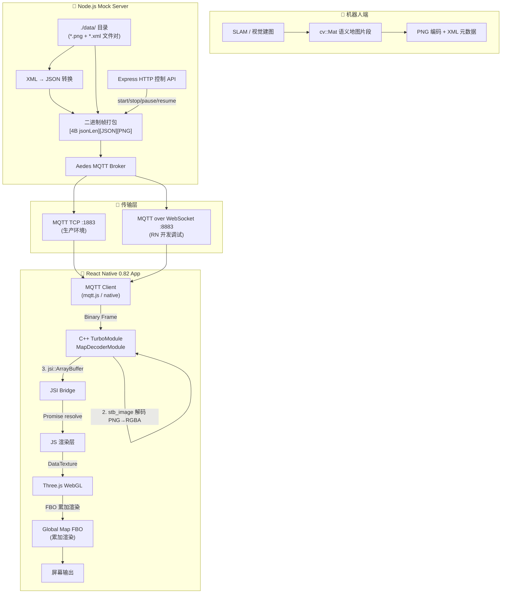

# 实时建图渲染系统 — 工程架构文档

## 1. 系统架构数据流图



### 数据流概要

| 步骤 | 位置 | 操作 | 数据格式 |
|------|------|------|----------|
| 1 | Server | 读取 PNG + XML 文件 | 磁盘文件 |
| 2 | Server | XML → JSON 转换 | JSON 对象 |
| 3 | Server | 二进制帧打包 | `[4B][JSON][PNG]` |
| 4 | Network | MQTT 发布 (QoS 0) | Binary payload |
| 5 | C++ | 帧头解析 + JSON 提取 | uint32 + string |
| 6 | C++ | stb_image PNG → RGBA | Raw pixel array |
| 7 | JSI | ArrayBuffer 暴露给 JS | jsi::ArrayBuffer → JS ArrayBuffer |
| 8 | JS | DataTexture 创建 | THREE.DataTexture |
| 9 | WebGL | FBO compositing | GPU texture |

---

## 2. MQTT 自定义二进制帧结构

### 帧格式定义

```
┌──────────────────┬─────────────────────────┬──────────────────────┐
│  Header (4 B)    │  JSON Payload (N B)     │  PNG Binary (M B)    │
│  JSON Length BE  │  UTF-8 encoded JSON     │  Raw PNG file bytes  │
└──────────────────┴─────────────────────────┴──────────────────────┘

Offset   Size     Type        Description
──────────────────────────────────────────────────────────
0        4        uint32_be   JSON payload 的字节长度 N
4        N        UTF-8       JSON 元数据字符串
4+N      M        binary      PNG 图像原始二进制 (M = total_len - 4 - N)
```

### JSON 元数据字段

```json
{
  "timestamp_ms": 1774431063489377,
  "resolution":   0.05,
  "origin_x":     24.1,
  "origin_y":     24.15,
  "map_cols":     40,
  "map_rows":     40,
  "seq":          0,
  "frame_index":  0,
  "total_frames": 1500,
  "loop":         0
}
```

| 字段 | 类型 | 说明 |
|------|------|------|
| `timestamp_ms` | float64 | 数据采集时的原始时间戳 (微秒级) |
| `resolution` | float64 | 每像素对应的物理尺寸 (米/像素)，当前固定 0.05 |
| `origin_x` | float64 | 地图片段中心点的世界坐标 X (米) |
| `origin_y` | float64 | 地图片段中心点的世界坐标 Y (米) |
| `map_cols` | int | 图像宽度 (像素) |
| `map_rows` | int | 图像高度 (像素) |
| `seq` | int | 全局递增序号 (从 0 开始) |
| `frame_index` | int | 当前帧在数据集中的索引 |
| `total_frames` | int | 数据集总帧数 |
| `loop` | int | 循环播放次数 |

### C++ 解包伪代码

```cpp
// 假设 buf 是收到的 MQTT payload, len 是总长度
uint32_t jsonLen = (buf[0]<<24) | (buf[1]<<16) | (buf[2]<<8) | buf[3];
std::string json(reinterpret_cast<char*>(buf+4), jsonLen);
const uint8_t* pngData = buf + 4 + jsonLen;
size_t pngLen = len - 4 - jsonLen;
```

---

## 3. 服务端 Mock 程序运行指南

### 环境要求

- **Node.js** >= 18.x
- **npm** >= 9.x

### 安装与启动

```bash
cd server/
npm install
npm start
```

### 启动后输出

```
[MQTT-TCP]  Broker listening on tcp://0.0.0.0:1883
[MQTT-WS]   Broker listening on ws://0.0.0.0:8883
[HTTP]      Control API on http://0.0.0.0:3000
```

### HTTP 控制 API

| 方法 | 路径 | 说明 | 示例 |
|------|------|------|------|
| `GET` | `/status` | 查看推流状态 | `curl http://localhost:3000/status` |
| `POST` | `/start` | 开始推流 | `curl -X POST http://localhost:3000/start` |
| `POST` | `/stop` | 停止推流 | `curl -X POST http://localhost:3000/stop` |
| `POST` | `/pause` | 暂停推流 | `curl -X POST http://localhost:3000/pause` |
| `POST` | `/resume` | 恢复推流 | `curl -X POST http://localhost:3000/resume` |

### 推流状态机

```
         POST /start              POST /pause
  IDLE ──────────────► RUNNING ──────────────► PAUSED
   ▲                      │                       │
   │   POST /stop         │  POST /stop           │ POST /resume
   └──────────────────────┘                       │
   └──────────────────────────────────────────────┘
                          POST /stop
```

### MQTT Topic

- **Topic**: `robot/map/increment`
- **QoS**: 0 (fire-and-forget，适合高频实时数据)
- **默认频率**: 10 Hz (100ms 间隔)
- **行为**: 遍历 `./data/` 目录中的所有 PNG+XML 文件对，按时间戳排序循环发送

### 验证连接 (使用 mosquitto_sub)

```bash
# TCP 连接
mosquitto_sub -h localhost -p 1883 -t "robot/map/increment" -v

# 或用 Node.js mqtt 客户端连接 WebSocket
# const mqtt = require('mqtt')
# const client = mqtt.connect('ws://localhost:8883')
```

---

## 4. RN 端 C++ TurboModule 集成指南

### 4.1 项目结构

```
your-rn-app/
├── android/
│   └── app/
│       └── src/main/
│           └── jni/
│               └── CMakeLists.txt  ← 引入 MapDecoderModule
├── ios/
│   └── YourApp/
│       └── MapDecoderModule.h/cpp  ← 直接加入 Xcode 项目
├── cpp/
│   ├── MapDecoderModule.h
│   ├── MapDecoderModule.cpp
│   ├── stb_image.h              ← 从 GitHub 下载
│   └── CMakeLists.txt
└── js/
    ├── useMapDecoder.ts
    └── IncrementalMapRenderer.ts
```

### 4.2 stb_image.h 获取

```bash
# 从官方仓库下载 (单文件 header-only 库)
curl -o cpp/stb_image.h https://raw.githubusercontent.com/nothings/stb/master/stb_image.h
```

### 4.3 Android CMakeLists 关键配置

在你的 RN App 的 `android/app/src/main/jni/CMakeLists.txt` 中添加：

```cmake
# 引入 MapDecoderModule
add_subdirectory(
  ${CMAKE_CURRENT_SOURCE_DIR}/../../../../cpp
  ${CMAKE_CURRENT_BINARY_DIR}/map_decoder_module
)

target_link_libraries(${CMAKE_PROJECT_NAME}
  map_decoder_module
)
```

### 4.4 iOS Podspec 配置

在你的 native module podspec 中:

```ruby
Pod::Spec.new do |s|
  s.name         = "MapDecoderModule"
  s.source_files = "cpp/**/*.{h,cpp}"
  s.compiler_flags = "-DSTB_IMAGE_IMPLEMENTATION"
  s.pod_target_xcconfig = {
    "CLANG_CXX_LANGUAGE_STANDARD" => "c++17",
    "HEADER_SEARCH_PATHS" => "\"$(PODS_TARGET_SRCROOT)/cpp\""
  }
end
```

### 4.5 模块注册 (AppDelegate / OnLoad)

**Android (JNI OnLoad)**:

```cpp
#include "MapDecoderModule.h"

// 在 RN 0.82 新架构的 TurboModule provider 中:
void installNativeModules(jsi::Runtime& rt,
                          std::shared_ptr<CallInvoker> jsInvoker) {
  auto mapModule = std::make_shared<facebook::react::MapDecoderModule>(jsInvoker);
  facebook::react::MapDecoderModule::install(rt, mapModule);
}
```

**iOS (AppDelegate.mm)**:

```objc
#import "MapDecoderModule.h"

// 在 RCTCxxBridgeDelegate 的 jsExecutorFactoryForBridge: 中
// 或在新架构的 RCTHost 配置中:
auto mapModule = std::make_shared<facebook::react::MapDecoderModule>(jsCallInvoker);
facebook::react::MapDecoderModule::install(runtime, mapModule);
```

### 4.6 内存管理核心注意事项

#### 1. ArrayBuffer 所有权转移 (关键!)

```
MQTT binary → std::vector<uint8_t> (C++ copy)
           → stb_image decode → RGBA vector
           → VectorBuffer (shared_ptr) → jsi::ArrayBuffer
           → JS GC 生命周期管理
```

- C++ `decodeMapFrameAsync` 接收 JS ArrayBuffer 时，**立即拷贝**数据到 `std::vector`，因为原始 ArrayBuffer 可能在异步执行期间被 GC 回收。
- 解码后的 RGBA 数据通过 `VectorBuffer`（继承 `jsi::MutableBuffer`）封装，其内部持有 `shared_ptr<vector<uint8_t>>`，确保数据在 JS 持有 ArrayBuffer 引用期间不会被释放。
- 当 JS 的 ArrayBuffer 被 GC 回收时，`VectorBuffer` 的析构函数自动释放内存。

#### 2. stb_image 内存安全

```cpp
// ✅ 正确：decode 后立即 copy + free
uint8_t* decoded = stbi_load_from_memory(...);
std::memcpy(fragment->rgbaData.data(), decoded, rgbaSize);
stbi_image_free(decoded);  // 必须释放！

// ❌ 错误：直接持有 stbi 返回的指针
// stbi 使用 malloc 分配，不能用 delete/vector 管理
```

#### 3. Three.js 纹理内存

```typescript
// ✅ DataTexture 复用（避免每帧 new Texture）
if (existingTexture && sameSize) {
  existingTexture.image.data.set(newRgbaArray);
  existingTexture.needsUpdate = true;
} else {
  oldTexture?.dispose();  // 必须手动 dispose GPU 资源！
  // create new texture...
}
```

#### 4. 线程安全

- `decodeFrame()` 是纯函数（无共享状态），可安全在后台线程调用。
- `jsInvoker->invokeAsync()` 确保 JSI 对象只在 JS 线程访问。
- **禁止**在后台线程直接操作 `jsi::Runtime`。

### 4.7 性能调优建议

| 环节 | 优化手段 | 预期效果 |
|------|----------|----------|
| PNG 解码 | 使用 stb_image (轻量) 或 libpng (并行) | ~1ms per 40x40 tile |
| 数据传递 | jsi::ArrayBuffer 零拷贝 | 避免 Bridge 序列化开销 |
| 纹理上传 | DataTexture 复用 + needsUpdate | 减少 GPU 内存分配 |
| FBO 累加 | autoClear=false + 正交投影 | 单次 draw call 完成合成 |
| MQTT QoS | 使用 QoS 0 | 最低延迟，允许丢帧 |

---

## 附录：完整文件清单

```
project/
├── server/
│   ├── package.json           # Node.js 依赖
│   └── server.js              # Mock 服务端主程序
├── rn-module/
│   ├── cpp/
│   │   ├── CMakeLists.txt     # Android C++ 编译配置
│   │   ├── MapDecoderModule.h # C++ TurboModule 头文件 (含实现)
│   │   └── MapDecoderModule.cpp # stb_image 实现 + 编译入口
│   └── js/
│       ├── useMapDecoder.ts          # JSI 类型定义 + JS fallback 解析
│       └── IncrementalMapRenderer.ts # Three.js FBO 累加渲染器
├── data/
│   ├── *.png                  # 地图片段图像 (40x40 px)
│   └── *.xml                  # OpenCV 元数据 (origin, resolution)
└── docs/
    └── ARCHITECTURE.md        # 本文档
```
