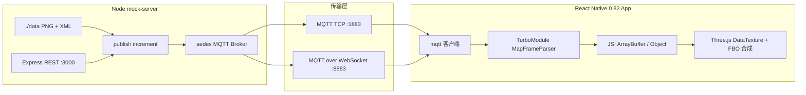

# 机器人实时建图 Mock 与 RN 渲染链路说明

本文档描述从 Node.js Mock 服务、MQTT 二进制帧、到 React Native 0.82（新架构）TurboModule + JSI + Three.js 的端到端数据流，供联调与工程维护使用。

**手动把 Native 代码接入自有 RN 工程**：见 **[`MANUAL_INTEGRATION.md`](./MANUAL_INTEGRATION.md)**。

---

## 1. 系统架构与数据流

### 1.1 Mermaid 总览



### 1.2 逻辑链路（文字）

1. **Mock 服务**读取 `./data` 下成对的 `*.xml` / `*.png`，将 XML 元数据转为 JSON UTF-8，与 PNG 原始字节按自定义二进制帧拼包，经 **MQTT Topic**（默认 `robot/map/increment`）发布。
2. **RN 端**通过 MQTT TCP 或 WebSocket 订阅同一 Topic，收到 `Uint8Array` / `ArrayBuffer` payload（**非 Base64**）。
3. **C++ TurboModule** 解析帧头长度、取出 JSON 与 PNG；在 Native 侧用 **stb_image**（可替换为 OpenCV/libpng）解码为 **RGBA8**；通过 JSI 分配 **ArrayBuffer** 将像素交给 JS（当前 MVP 在 JSI 层做一次拷贝到 Hermes 拥有的 buffer，避免悬空指针）。
4. **Three.js** 用 `DataTexture` 引用该 buffer，在 ortho/UV 变换后绘制到 **RenderTarget（FBO）** 上，实现全局地图累加；用完 chunk 后 `dispose()` 释放 GPU 与对象引用。

---

## 2. MQTT 自定义二进制帧

### 2.1 载荷布局

Topic 默认：`robot/map/increment`（可通过 `POST /start` 的 `topic` 字段覆盖）。

| 字节区间 | 类型 | 说明 |
|---------|------|------|
| `[0..3]` | `uint32` **大端（Big-Endian）** | `N` = 紧随其后的 **JSON 元数据 UTF-8 字节长度**（不含 `\0`） |
| `[4 .. 4+N-1]` | `uint8[N]` | JSON 文本（UTF-8），由服务端将原 OpenCV XML 字段转换而来 |
| `[4+N .. end]` | `uint8[]` | **原始 PNG 文件字节**（与 HTTP `application/octet-stream` 一致，非 Base64） |

### 2.2 JSON 字段（与现有 XML 对齐）

示例（字段名与 `mock-server` 输出一致）：

```json
{
  "timestamp_ms": 1774431416580758,
  "resolution": 0.05,
  "origin_x": 24.25,
  "origin_y": 23.75,
  "map_cols": 40,
  "map_rows": 40,
  "rotation": 0
}
```

`rotation` 若 XML 中不存在，Mock 端补 `0`，便于与位姿/外参扩展对齐。

### 2.3 C++ 解析伪代码

```cpp
uint32_t n = (uint32_t(data[0])<<24) | (uint32_t(data[1])<<16) | (uint32_t(data[2])<<8) | uint32_t(data[3]);
const uint8_t* json = data + 4;
const uint8_t* png  = data + 4 + n;
size_t png_len = total_len - 4 - n;
// 校验 PNG magic: 89 50 4E 47 0D 0A 1A 0A
```

### 2.4 安全与健壮性

- **长度校验**：`total_len >= 4 + n`，并对 `n` 设置合理上限（本仓库 C++ 样例使用 `1<<27` 作为保守上限），防止恶意包体。
- **PNG 校验**：检查 magic，再交给解码器。
- **内存**：解码后的 Native buffer 必须在拷贝进 JSI `ArrayBuffer` 后 **`stbi_image_free` / OpenCV 释放**，避免泄漏。

---

## 3. Mock 服务端运行指南

### 3.1 目录与依赖

- 代码：`mock-server/`
- 默认数据目录：仓库根目录 `data/`（可用环境变量或 `POST /start` 覆盖）

安装与启动：

```bash
cd mock-server
npm install
npm start
```

### 3.2 环境变量

| 变量 | 默认 | 说明 |
|------|------|------|
| `PORT_HTTP` | `3000` | REST API |
| `PORT_MQTT_TCP` | `1883` | MQTT TCP |
| `PORT_MQTT_WS` | `8883` | MQTT over WebSocket（独立 HTTP 服务，仅承载 MQTT 流） |
| `DATA_DIR` | `<repo>/data` | 默认数据根目录 |
| `MOCK_HZ` | `10` | `/start` 未指定 `hz` 时的默认频率 |

若本机 **1883 已被占用**（常见 MQTT 代理），可临时改用：

```bash
PORT_MQTT_TCP=11883 PORT_MQTT_WS=18883 PORT_HTTP=13000 npm start
```

### 3.3 REST API

| 方法 | 路径 | 说明 |
|------|------|------|
| `GET` | `/status` | 推流状态、`pairCount`、已发送次数、最近错误、端口信息 |
| `POST` | `/start` | Body 可选：`hz`、`dataDir`、`topic`；扫描 PNG/XML 对并开始循环发送 |
| `POST` | `/stop` | 停止并清除定时器 |
| `POST` | `/pause` | 暂停发送（保持 running） |
| `POST` | `/resume` | 恢复发送 |

`POST /start` 示例：

```bash
curl -X POST http://127.0.0.1:3000/start \
  -H "Content-Type: application/json" \
  -d "{\"hz\":10,\"dataDir\":\"/absolute/path/to/data\"}"
```

### 3.4 RN / 浏览器侧连接 MQTT WebSocket

- WebSocket URL 形如：`ws://127.0.0.1:8883`（若改过端口则同步修改）。
- 使用 `mqtt` npm 包时，通常需显式 `path: '/'`，例如：

```js
import mqtt from 'mqtt';

const client = mqtt.connect('ws://127.0.0.1:8883', {
  path: '/',
  protocolVersion: 4,
});
```

具体以你所用客户端库的 WebSocket 选项为准；关键是 **升级到 MQTT 流的 WebSocket**，而非把 PNG 再包一层 Base64。

---

## 4. RN 0.82 TurboModule / C++ 集成要点

### 4.1 本仓库提供的 Native MVP 文件

| 路径 | 作用 |
|------|------|
| `react-native-mvp/cpp/MapFrameParserCore.{h,cpp}` | 帧解析 + `stb_image` 解码为 RGBA |
| `react-native-mvp/cpp/MapFrameParserJsi.{h,cpp}` | JSI 对象与 `ArrayBuffer` 组装（Hermes 分配 buffer + `memcpy`） |
| `react-native-mvp/cpp/NativeMapFrameParserModule.example.cpp` | TurboModule 与 Spec 对接示例（需按 codegen 类名替换） |
| `react-native-mvp/cpp/CMakeLists.snippet.cmake` | Android CMake 片段参考 |
| `react-native-mvp/js/NativeMapFrameParser.ts` | TurboModule JS 侧 Spec（建议放入 app 的 `codegenConfig` 目录） |
| `react-native-mvp/js/incrementTextureMVP.ts` | Three.js `DataTexture` 最小用法与 FBO 合成注释 |
| `third_party/stb_image.h` | stb_image 单头文件（可按合规流程改为子模块） |

### 4.2 CMake / 编译

- 将 `MapFrameParserCore.cpp`、`MapFrameParserJsi.cpp` 加入应用的 Native 目标。
- `target_include_directories` 需包含：当前 `cpp` 目录与 **`third_party`**（或把 `stb_image.h` 安装到统一 include 路径）。
- **仅在一个翻译单元**定义 `#define STB_IMAGE_IMPLEMENTATION`（本仓库已在 `MapFrameParserCore.cpp` 中定义，勿重复）。
- 链接 **JSI** 与 React Native 提供的 ReactCommon 目标（Android prefab / iOS Pods 由模板工程提供）。

### 4.3 跨语言内存与线程（重要）

**当前 MVP 策略（安全优先）**

1. JSI 入口将 `ArrayBuffer` 内容 **拷贝到 `std::vector<uint8_t>`** 再解析，避免异步线程与 JSI 生命周期打架。
2. 解码得到 RGBA 后，在 JS 线程上 **新建 `ArrayBuffer` 并 `memcpy`**，再把 `stbi_image_free` 的 Native 指针释放。

这样会有 **两次拷贝**（payload + RGBA），但避免了：

- 异步解码完成后 **`jsi::Runtime&` 悬空引用**（常见错误：在 `std::thread` 里捕获栈上 `rt`）。
- 将 Native 堆指针直接交给 JS 而 **无稳定 finalize / external ArrayBuffer** 协议。

**生产演进方向**

- 使用 RN 提供的 **RuntimeScheduler / CallInvoker** 在 **Native 线程解码**，仅在 **JS 线程** 使用有效 `Runtime` 创建 `ArrayBuffer`。
- 若需逼近零拷贝：使用平台与 Hermes 版本支持的 **external ArrayBuffer + finalize 回调**（需严格测试卸载与 GC 时序），或 **共享 GPU 路径**（上传纹理在 Native 侧完成）。

### 4.4 同步解码与 UI 卡顿

本仓库示例 **`decodeIncrementFrameSync`** 在 **JS 线程**执行 PNG 解码，大图会卡帧。上线前应：

- 改为 **后台线程解码 + JS 线程 marshal**；或
- 在机器人端改为 **下发已压缩的更小 patch / 或 GPU 友好格式**（需协议升级）。

### 4.5 Three.js 与 FBO 累加（概要）

1. 创建大尺寸 `WebGLRenderTarget` 作为全局地图。
2. 每个增量：`decodeMqttPayloadToTexture` 得到 `DataTexture` + `meta`。
3. 用正交相机 + 全屏/四边形，把 chunk 按 `origin_x/y`、`resolution`、`rotation` 映射到地图 UV。
4. `renderer.setRenderTarget(globalRT)` 后执行一次 pass，将新数据 **alpha 混合/最大值/自定义 occupancy 规则** 合成进全局纹理。
5. 合成完成后 **`chunkTexture.dispose()`**，并避免长期持有 `Uint8Array` 视图引用，便于 GC。

---

## 5. 与生产协议的差异说明

- Mock 服务将 **XML 转为 JSON** 内嵌于二进制帧；若生产仍传 XML，可在 C++ 替换 JSON 段解析逻辑，帧结构可保持不变（仅 `N` 段内容变为 XML UTF-8）。
- 生产环境 MQTT 可能带 **TLS、用户名密码、不同 WebSocket path**；本 Mock 为本地明文调试用途。

---

## 6. 任务四：Native MQTT 后台线程架构

高频场景下，建议在 C++ 侧使用 **`MapStreamWorker` + Paho `MQTTAsync`**，在专用工作线程完成 PNG 解码，并通过 TurboModule 在 JS 线程暴露 `consumeLatestFrame` 与状态回调。详见 **[`docs/MAP_STREAM_WORKER.md`](./MAP_STREAM_WORKER.md)**（并发模型、Paho 集成、`ArrayBuffer` 所有权与生命周期）。

---

## 7. 许可证说明

`third_party/stb_image.h` 来自 [stb](https://github.com/nothings/stb)（公共领域 / 宽松许可，以文件头为准）。发布产品前请按贵司合规流程归档第三方声明。
