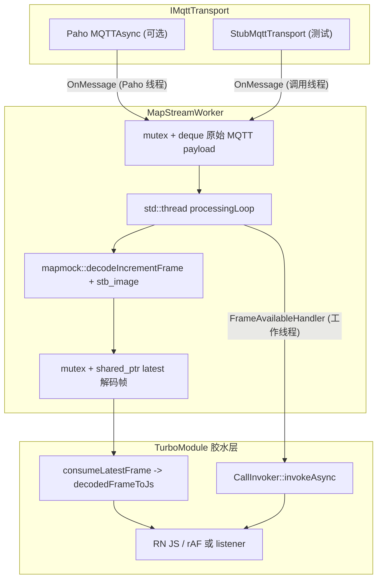

# MapStreamWorker：C++ 后台线程 + MQTT 异步架构（任务四）

本文档描述 `native-map-stream` 模块的设计目标、并发模型、与 React Native 0.82 TurboModule 的集成方式，以及 **JSI `ArrayBuffer` 所有权** 与内存安全约束。适用于后续维护与代码评审。

**逐步拷贝源码、配置 Codegen、Android/iOS 编译与注册**：见 **[`MANUAL_INTEGRATION.md`](./MANUAL_INTEGRATION.md)**。

---

## 1. 设计目标

| 目标 | 说明 |
|------|------|
| **JS 线程不解码** | PNG 解析与 RGBA 生成只在 Native 工作线程执行，避免 10Hz+ 流在 JS 线程卡顿。 |
| **模块化** | `MapStreamWorker` 与 `IMqttTransport` **不依赖 JSI / RN**，可在纯 C++ 环境单测或 `smoke_test` 验证。 |
| **可替换传输** | 默认 `StubMqttTransport`；生产启用 **Eclipse Paho `MQTTAsync`**（`-DMAPSTREAM_WITH_PAHO`）。 |
| **可控背压** | 队列超过 `kMaxQueuedPayloads` 时丢弃最旧包，避免内存膨胀。 |
| **pause/resume** | `pause` 时 **仍维持 MQTT 会话**（心跳由 Paho/网络栈负责），但 **不入队/不解码**（当前实现直接丢弃到达消息以省 CPU）。 |

---

## 2. 架构总览（Mermaid）



---

## 3. 并发与“双缓冲”语义

### 3.1 网络 → 解码

- **入站路径**：`IMqttTransport::OnMessage` 可能在 **Paho 内部线程**触发，函数内只做 **短临界区入队**（`enqueuePayload`），避免阻塞 Paho。
- **解码路径**：专用 `processingLoop` 线程从队列取出 payload，调用 `mapmock::decodeIncrementFrame`（与任务一帧格式一致）。

### 3.2 解码结果 → JS 读取

实现采用 **“最新帧槽位 + `std::shared_ptr<const DecodedMapFrame>`”**：

- 写线程（工作线程）在 `latestMu_` 下替换 `latest_` 指针；读线程（JS 线程，`consumeLatestFrame`）复制 `shared_ptr`（原子引用计数递增），**不拷贝 RGBA 字节**。
- 这与经典 **double buffering** 等价：永远只暴露一份“当前最新完整帧”；若需要 **无锁读指针**，可在 C++20 将 `latest_` 升级为 `std::atomic<std::shared_ptr<const DecodedMapFrame>>`（需验证平台 `std::atomic<std::shared_ptr>` 可用性）。

### 3.3 队列缓冲

- `queue_` 作为 **网络与解码之间的有界缓冲**；爆满时 **丢最旧**，保证实时性优先于完整性（地图流场景通常可接受掉帧）。

---

## 4. MQTT：Paho MQTTAsync 集成说明

- 源码：`native-map-stream/src/paho_mqtt_async_transport.cpp`（`-DMAPSTREAM_WITH_PAHO`）。
- 关闭宏时，`createPahoMqttAsyncTransport()` 返回 `nullptr`，胶水层应回退到 Stub 或断言配置错误。
- **链接**：需将 **eclipse-paho-mqtt-c** 的异步库（常见目标名 `paho-mqtt3as`）加入 CMake / Gradle / Xcode；并在 TLS 场景补齐证书与 OpenSSL 依赖（此处不展开）。
- **回调线程**：`messageArrived` 在 Paho 线程执行；**禁止**在此线程直接调用 JSI。

> **版本差异**：不同 Paho 版本对 `MQTTAsync_messageArrived` 返回值与 `topic/message` 释放策略略有差异。集成后请在目标版本上做一次 **泄漏/崩溃** 单测；如发现与本文假设不一致，以 **官方头文件注释** 为准调整 `onMessageArrivedStatic`。

---

## 5. 状态机（Native）

| 方法 | 行为 |
|------|------|
| `connect(cfg)` | `stopRequested_` 复位、启动工作线程、`transport->connectAsync`（**不自动 SUBSCRIBE**）。状态：`Connecting` → `Connected` / `Error`。 |
| `startSubscription()` | `SUBSCRIBE`，`Subscribed`（若未 pause）。 |
| `stopSubscription()` | `UNSUBSCRIBE`，回到 `Connected`（或 `Paused` 细节见实现）。 |
| `pause()` | `paused_=true`，`Paused`；MQTT 会话仍由 transport 维持。 |
| `resume()` | `paused_=false`，按是否订阅恢复 `Subscribed` / `Connected`。 |
| `disconnect()` | 幂等：`stopRequested_`、唤醒队列、`disconnectAsync`、join 线程。 |

**状态回调**：`setStateHandler` 可能在 **任意线程**触发（Paho/工作线程）；TurboModule 胶水层 **必须** `CallInvoker::invokeAsync` 再触碰 JS。

---

## 6. TurboModule 集成（C++ 胶水层）

### 6.1 推荐职责划分

| 层级 | 职责 |
|------|------|
| `MapStreamWorker` | MQTT + 队列 + 解码 + `latest_` 发布 + `FrameAvailableHandler`。 |
| `MapStreamTurboModule`（你实现） | 解析 `connect` 配置、创建 `IMqttTransport`、把状态/帧事件 **调度到 JS 线程**、持有 `jsi::Function` 监听器。 |
| `mapstream_jsi::decodedFrameToJs` | 仅运行在 **JS 线程**，把 `DecodedMapFrame` 转成 JS 对象。 |

参考骨架：`react-native-mvp/cpp/MapStreamTurboModule.example.cpp`。

### 6.2 帧通知策略

两种等价方案：

1. **推模式**：`setFrameTickListener` 保存 `jsi::Function`，在 `FrameAvailableHandler` 中 `invokeAsync` 调用（注意 **节流**：10Hz 可全量推送；更高频建议合并）。
2. **拉模式**：仅 `invokeAsync` 一个空 tick，JS 在 `requestAnimationFrame` 中调用 `consumeLatestFrame()`（减少跨边界函数对象创建）。

---

## 7. JSI `ArrayBuffer` 所有权与“零拷贝”边界

### 7.1 推荐实现（本仓库）

文件：`react-native-mvp/cpp/MapStreamJsi.cpp`

- `DecodedMapFrame::rgba` 为 `std::shared_ptr<std::vector<uint8_t>>`。
- `SharedVectorMutableBuffer` 继承 `facebook::jsi::MutableBuffer`，内部持有 **同一个** `shared_ptr<vector<uint8_t>>`。
- 构造 `jsi::ArrayBuffer(rt, std::shared_ptr<MutableBuffer>)`（具体符号以你使用的 **React Native / Hermes 版本**的 `jsi.h` 为准）。

**所有权链**：

1. 解码线程分配 `vector` → 放入 `DecodedMapFrame` → 写入 `latest_`（`shared_ptr` 引用计数 ≥ 1）。
2. JS 线程 `consumeLatestFrame` 复制 `shared_ptr` 并生成 `ArrayBuffer` → `MutableBuffer` 再 **+1 引用**。
3. 当 JS 侧 `latest_` 被新一帧替换、且旧 `ArrayBuffer` 已被 GC 回收 → `MutableBuffer` 析构 → `vector` 引用计数归零 → **C++ 释放内存**。

**结论**：**释放责任在 C++ 堆对象（vector）上，由 `shared_ptr` 与 JSI ArrayBuffer 包装器的析构共同完成；JS 引擎 GC 只触发 C++ 侧 `MutableBuffer` 的销毁，不直接 `free` 裸指针。**

### 7.2 引擎是否会额外拷贝？

部分 RN/Hermes 组合在创建 `ArrayBuffer` 时可能 **拷贝**到引擎自有 arena。**是否真正零拷贝必须以 Profiler / 源码为准**。若发生隐式拷贝，仍 **安全**，但 CPU 开销上升；可评估：

- 改为 **GPU 上传在 Native 完成**（OpenGL/Vulkan 扩展模块），JS 只拿纹理句柄；
- 或缩小下发 tile / 改用更轻量中间格式（协议级优化）。

### 7.3 反模式（避免）

- 把 **指向栈内存**或 **已释放** `stbi` 指针** 直接交给 `ArrayBuffer`。
- 在 **非 JS 线程**创建/访问 `jsi::Object`、`jsi::ArrayBuffer`、`jsi::Function`。
- `invokeAsync` 捕获 **`jsi::Runtime&`** 或 **`jsi::Function`** 默认按值捕获后在线程间乱传（应仅在 JS 队列闭包内使用，并在模块销毁时 **清空监听器**）。

---

## 8. JS 层使用（对照 `NativeMapStream.ts`）

`react-native-mvp/js/NativeMapStream.ts` 给出 TurboModule 形状示例。典型流程：

```typescript
import NativeMapStream from './NativeMapStream';
import { decodeMqttPayloadToTexture } from './incrementTextureMVP'; // 或直接用 consumeLatestFrame 输出

NativeMapStream.connect({
  host: '127.0.0.1',
  port: 1883,
  topic: 'robot/map/increment',
  usePaho: true,
});
NativeMapStream.start();

NativeMapStream.setStateListener((state, detail) => {
  // UI: Connecting / Connected / Subscribed / Paused / Error / Disconnected
});

NativeMapStream.setFrameTickListener(() => {
  const frame = NativeMapStream.consumeLatestFrame();
  if (!frame) return;
  // frame.rgba -> THREE.DataTexture / react-three-fiber ...
});

NativeMapStream.pause(); // 省电：停止解码
NativeMapStream.resume();

NativeMapStream.stop(); // 仅退订
NativeMapStream.disconnect(); // 断开 + 停线程
```

> **Codegen**：把 `NativeMapStream.ts` 放入你工程的 `codegenConfig.jsSrcsDir`，运行 `npx react-native codegen`，再用 C++ 实现生成的 `NativeMapStreamCxxSpec` 子类。

---

## 9. 生命周期与 App 后台

| 场景 | 建议 |
|------|------|
| **RN 组件卸载** | 调用 `disconnect()`；在 TurboModule `invalidate` 中 **先清空 `jsi::Function` 监听器**，再 `disconnect()`，顺序防止回调打到已销毁 UI。 |
| **App 进入后台** | 可 `pause()` 保留连接；或 `stop()` + `disconnect()` 视产品策略。 |
| **热重载 / DevMenu** | 确保旧 `MapStreamWorker` **只销毁一次**；避免重复 `connect` 未 `disconnect` 造成线程泄漏。 |

---

## 10. 构建与单测

### 10.1 CMake（独立 C++）

```bash
cd native-map-stream
cmake -S . -B build -DCMAKE_BUILD_TYPE=Release
cmake --build build
./build/mapstream_smoke_test
```

> 若环境无 CMake，可直接把 `src/*.cpp` 与 `MapFrameParserCore.cpp` 加入 Android/iOS 工程，并设置 include 路径：`include`、`../react-native-mvp/cpp`、`../third_party`。

### 10.2 启用 Paho

```bash
cmake -S . -B build -DMAPSTREAM_WITH_PAHO=ON
# 并在 CMakeLists 中取消注释 / 补充 target_link_libraries(Paho ...)
```

---

## 11. 与任务一～三的衔接

- **帧格式**：与 `docs/ARCHITECTURE.md` 第 2 节一致（4 字节大端 JSON 长度 + JSON + PNG）。
- **解码实现**：复用 `react-native-mvp/cpp/MapFrameParserCore.cpp`（`stb_image`）。
- **Mock 服务**：继续用 `mock-server` 推流；RN 端改为 **Native MQTT** 后，可移除 JS 侧 `mqtt` 客户端以避免重复拷贝（视架构而定）。

---

## 12. 文件索引

| 路径 | 说明 |
|------|------|
| `native-map-stream/include/mapstream/map_stream_worker.h` | 核心 Worker API |
| `native-map-stream/include/mapstream/i_mqtt_transport.h` | 传输抽象 + 工厂 |
| `native-map-stream/src/map_stream_worker.cpp` | 线程 + 队列 + 解码 |
| `native-map-stream/src/paho_mqtt_async_transport.cpp` | Paho 实现（可选宏） |
| `native-map-stream/src/stub_mqtt_transport.cpp` | 本地测试 Stub |
| `native-map-stream/tools/smoke_test.cpp` | 最小可运行 C++ 烟测 |
| `react-native-mvp/cpp/MapStreamJsi.{h,cpp}` | JSI 外部 `ArrayBuffer` 组装 |
| `react-native-mvp/cpp/MapStreamTurboModule.example.cpp` | TurboModule 胶水注释模板 |
| `react-native-mvp/js/NativeMapStream.ts` | JS Spec 草案 |

---

## 13. 后续可增强点（非本阶段必需）

- `pause` 时改为 **入队但标记丢弃**，以便统计丢包率。
- 将 `FrameAvailableHandler` 与渲染 **vsync** 对齐（结合 `RCTDisplayLink` / `Choreographer`）。
- 将 PNG 解码替换为 **硬件解码器** 或 **预压缩纹理格式**（需改协议）。
- 使用 **有界线程池** 若未来引入多 topic / 非地图 CPU 任务。
